# Laporan Hasil Praktikum: Final Project Aplikasi Berbasis Container

## Identitas Mahasiswa

* **Nama:** Tude Ryan Wijaya Kusuma
* **NIM:** 2415354020
* **Kelas/Rombel:** TRPL D
* **Tanggal Praktikum:** 20 Mei 2026

\---

## Teknologi \& Tools yang Digunakan

* **Sistem Operasi:** Windows 11
* **Containerization:** Docker \& Docker Hub
* **Bahasa Pemrograman / Framework:** Node.js
* **Tools Lain:** VS Code, Git, MYSQL, phpmyadmin

\---

## Langkah-Langkah Praktikum \& Dokumentasi

### Langkah 1: \[Menambahkan package.json dan install dependency]

Pada langkah pertama ini dilakukan pembuatan file package.json untuk menyimpan konfigurasi project Node.js serta menginstal dependency yang dibutuhkan untuk menjalankan aplikasi menggunakan framework Express dan koneksi database MySQL.

```bash
# Digunakan untuk membuat package.json
npm init -y

# Digunakan untuk menginstall dependency yang digunakan
npm install express mysql2 dotenv
```

**Dokumentasi/Screenshot:**
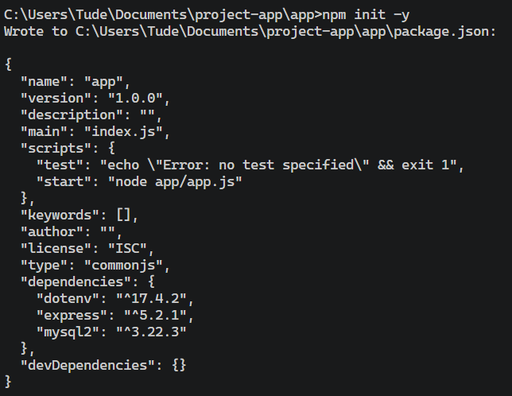
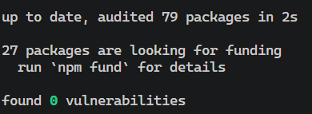


### Langkah 2: \[Menjalankan Docker Compose]

Pada langkah ini dilakukan proses build dan menjalankan container menggunakan Docker Compose. Selain itu dilakukan pengecekan status container serta melihat log aplikasi untuk memastikan aplikasi dan database berjalan dengan baik.

```bash
# Build image dan menjalankan container di background
docker compose -d --build

# Melihat status container yang sedang berjalan
docker compose ps

# Melihat log container
docker compose logs
```

**Dokumentasi/Screenshot:**
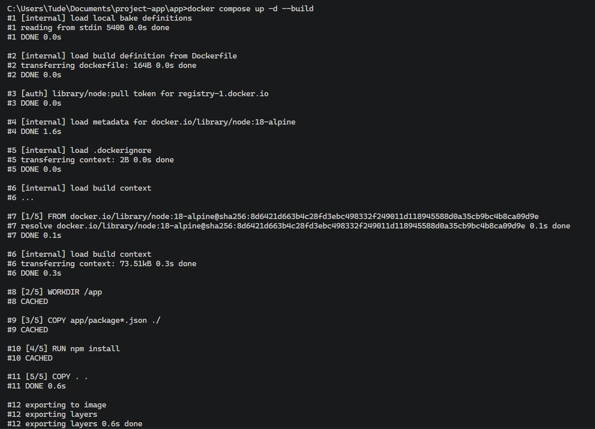
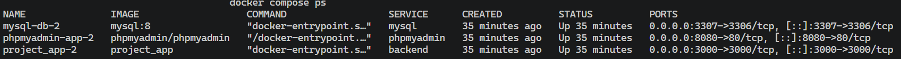
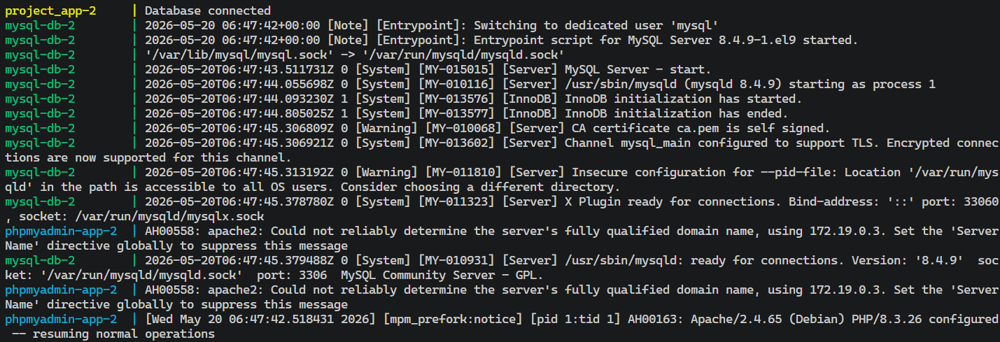

### Langkah 3: \[Melakukan Pengujuan Volume Docker]

Pada langkah ini dilakukan pengujian volume Docker untuk memastikan data database tersimpan secara persisten walaupun container dihentikan atau dihapus.

```bash
# Melihat daftar volume Docker
docker volume ls

# Melihat detail volume yang digunakan
docker volume inspect project-app_mysql-data
```

**Dokumentasi/Screenshot:**
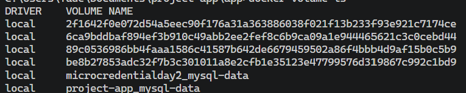
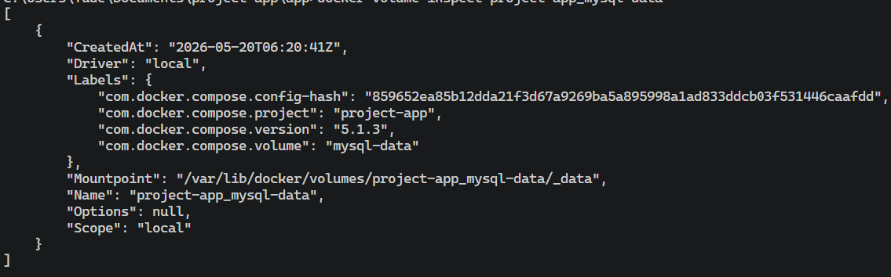

### Langkah 4: \[Melakukan Pengujian Network dan Container]

Pada langkah ini dilakukan pengujian koneksi network dan container dengan mengakses aplikasi melalui browser untuk memastikan container aplikasi dapat berjalan dan saling terhubung dengan database.

```bash
# Mengakses endpoint utama aplikasi
localhost:3000/

# Mengakses endpoint users
localhost:3000/users
```

**Dokumentasi/Screenshot:**
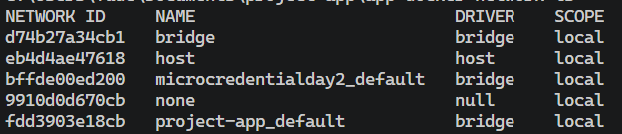
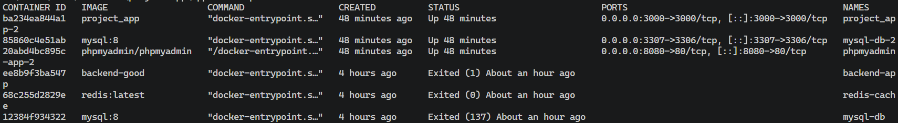

### Langkah 5: \[Melakukan Pengujian Endpoint Request dan Response]

Pada langkah ini dilakukan pengecekan network Docker dan container yang sedang berjalan untuk memastikan service aplikasi dan database aktif serta terhubung dengan baik.

```bash
# Melihat daftar network Docker
docker network ls

# Melihat daftar container yang berjalan
docker ps -a
```

**Dokumentasi/Screenshot:**
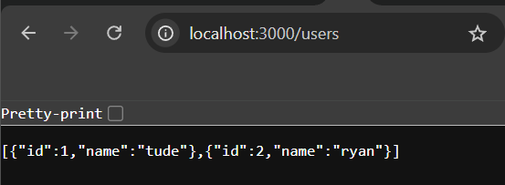
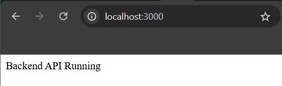

### Langkah 6: \[Melakukan Pengujian Upload ke Dockerhub]

Pada langkah ini dilakukan proses upload image Docker ke Docker Hub agar image aplikasi dapat disimpan secara online dan digunakan kembali pada perangkat lain.

```bash
# Login ke Docker Hub
docker login

# Mengubah nama image sesuai username Docker Hub
docker tag project_app tude/project_app

# Mengupload image ke Docker Hub
docker push tude/project_app
```

**Dokumentasi/Screenshot:**
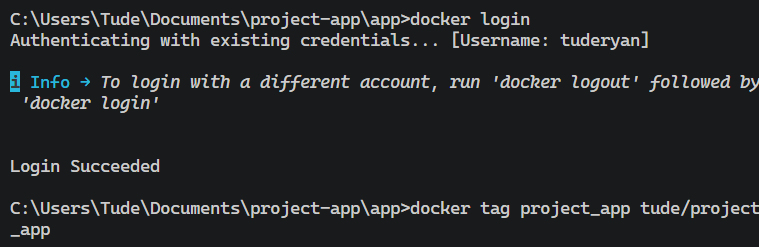
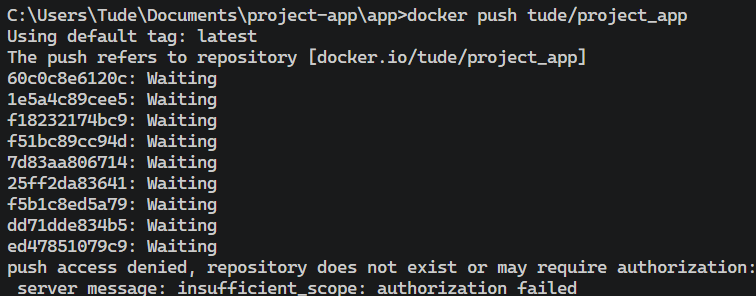

## Kesimpulan

Langkah 2: Membuat File Aplikasi Express

Pada langkah kedua ini dilakukan pembuatan file aplikasi utama menggunakan framework Express. File ini digunakan untuk menjalankan server Node.js dan membuat endpoint sederhana agar aplikasi dapat diakses melalui browser.

# Membuat file app.js
touch app.js
const express = require('express');
const app = express();

app.get('/', (req, res) => {
    res.send('Hello Docker');
});

app.listen(3000, '0.0.0.0', () => {
    console.log('App running');
});
### Langkah 2: \[Menjalankan compose up -d --build]

Jelaskan proses penamaan ulang *image* dan proses unggah ke Docker Hub milik Anda.


bash
docker compose -d --build

docker compose ps

docker compose logs
Langkah 2: Menjalankan Docker Compose

Pada langkah ini dilakukan proses build dan menjalankan container menggunakan Docker Compose. Selain itu dilakukan pengecekan status container serta melihat log aplikasi untuk memastikan aplikasi dan database berjalan dengan baik.

# Build image dan menjalankan container di background
docker compose up -d --build

# Melihat status container yang sedang berjalan
docker compose ps

# Melihat log container
docker compose logs
selesaikan readme saya ini yang belum masuk pada commandnya sekalian juga buat kesimpulannya
## Langkah-Langkah Praktikum \& Dokumentasi

### Langkah 1: \[Menambahkan package.json dan install dependency]

Pada langkah pertama ini dilakukan pembuatan file package.json untuk menyimpan konfigurasi project Node.js serta menginstal dependency yang dibutuhkan untuk menjalankan aplikasi menggunakan framework Express dan koneksi database MySQL.


bash
# Digunakan untuk membuat package.json
npm init -y
# Digunakan untuk menginstall dependency yang digunakan
npm install express mysql2 dotenv


**Dokumentasi/Screenshot:**


### Langkah 2: \[Menjalankan Docker Compose]

Pada langkah ini dilakukan proses build dan menjalankan container menggunakan Docker Compose. Selain itu dilakukan pengecekan status container serta melihat log aplikasi untuk memastikan aplikasi dan database berjalan dengan baik.


bash
# Build image dan menjalankan container di background
docker compose -d --build

# Melihat status container yang sedang berjalan
docker compose ps

# Melihat log container
docker compose logs


**Dokumentasi/Screenshot:**


### Langkah 3: \[Melakukan Pengujuan Volume Docker]

Jelaskan bagaimana cara melakukan verifikasi atau pengujian bahwa praktikum Anda berhasil berjalan.


bash
docker volume ls

docker volume inspect project-app_mysql-data


**Dokumentasi/Screenshot:**


### Langkah 4: \[Melakukan Pengujian Network dan Container]

Jelaskan bagaimana cara melakukan verifikasi atau pengujian bahwa praktikum Anda berhasil berjalan.


bash
localhost:3000/
localhost:3000/Users


**Dokumentasi/Screenshot:**


### Langkah 5: \[Melakukan Pengujian Endpoint Request dan Response]

Pengujian endpoint dilakukan untuk memastikan aplikasi dapat menerima request dan memberikan response dengan benar melalui browser maupun aplikasi API testing seperti Postman.


bash
docker network ls

docker ps -a


**Dokumentasi/Screenshot:**


### Langkah 6: \[Melakukan Pengujian Upload ke Dockerhub]

Pengujian endpoint dilakukan untuk memastikan aplikasi dapat menerima request dan memberikan response dengan benar melalui browser maupun aplikasi API testing seperti Postman.


bash
docker login
docker tag project_app tude/project_app
docker push tude/project_app


**Dokumentasi/Screenshot:**


## Kesimpulan

Tuliskan kesimpulan singkat atau kendala yang Anda hadapi beserta solusinya selama melakukan praktikum ini di sini.
Langkah-Langkah Praktikum & Dokumentasi
Langkah 1: [Menambahkan package.json dan install dependency]

Pada langkah pertama ini dilakukan pembuatan file package.json untuk menyimpan konfigurasi project Node.js serta menginstal dependency yang dibutuhkan untuk menjalankan aplikasi menggunakan framework Express dan koneksi database MySQL.

# Digunakan untuk membuat package.json
npm init -y

# Digunakan untuk menginstall dependency yang digunakan
npm install express mysql2 dotenv

Dokumentasi/Screenshot:


Langkah 2: [Menjalankan Docker Compose]

Pada langkah ini dilakukan proses build image dan menjalankan container menggunakan Docker Compose. Selain itu dilakukan pengecekan status container serta melihat log aplikasi untuk memastikan aplikasi dan database berjalan dengan baik.

# Build image dan menjalankan container di background
docker compose up -d --build

# Melihat status container yang sedang berjalan
docker compose ps

# Melihat log container
docker compose logs

Dokumentasi/Screenshot:


Langkah 3: [Melakukan Pengujian Volume Docker]

Pada langkah ini dilakukan pengujian volume Docker untuk memastikan data database tersimpan secara persisten walaupun container dihentikan atau dihapus.

# Melihat daftar volume Docker
docker volume ls

# Melihat detail volume yang digunakan
docker volume inspect project-app_mysql-data

Dokumentasi/Screenshot:


Langkah 4: [Melakukan Pengujian Network dan Container]

Pada langkah ini dilakukan pengujian koneksi network dan container dengan mengakses aplikasi melalui browser untuk memastikan container aplikasi dapat berjalan dan saling terhubung dengan database.

# Mengakses endpoint utama aplikasi
localhost:3000/

# Mengakses endpoint users
localhost:3000/users

Dokumentasi/Screenshot:


Langkah 5: [Melakukan Pengujian Endpoint Request dan Response]

Pada langkah ini dilakukan pengecekan network Docker dan container yang sedang berjalan untuk memastikan service aplikasi dan database aktif serta terhubung dengan baik.

# Melihat daftar network Docker
docker network ls

# Melihat daftar container yang berjalan
docker ps -a

Dokumentasi/Screenshot:


Langkah 6: [Melakukan Pengujian Upload ke Dockerhub]

Pada langkah ini dilakukan proses upload image Docker ke Docker Hub agar image aplikasi dapat disimpan secara online dan digunakan kembali pada perangkat lain.

# Login ke Docker Hub
docker login

# Mengubah nama image sesuai username Docker Hub
docker tag project_app tude/project_app

# Mengupload image ke Docker Hub
docker push tude/project_app

Dokumentasi/Screenshot:


Kesimpulan

Berdasarkan praktikum yang telah dilakukan, aplikasi Node.js berhasil dijalankan menggunakan Docker dan Docker Compose. Container aplikasi dan database dapat saling terhubung melalui network Docker, serta data database berhasil disimpan menggunakan volume Docker. Selain itu, image aplikasi juga berhasil diunggah ke Docker Hub sehingga dapat digunakan kembali pada lingkungan lain.

Kendala yang sempat dihadapi adalah container aplikasi tidak dapat langsung terhubung ke database karena service MySQL belum siap sepenuhnya saat container dijalankan. Masalah tersebut dapat diatasi dengan menambahkan mekanisme retry koneksi database pada aplikasi Node.js sehingga aplikasi akan mencoba kembali koneksi hingga database siap digunakan.

